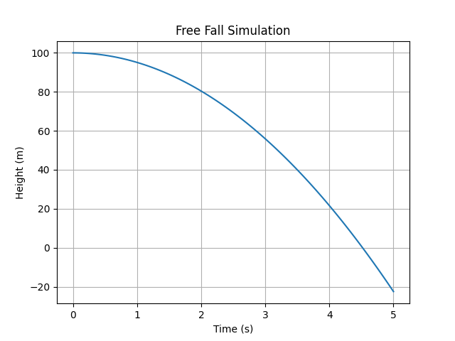
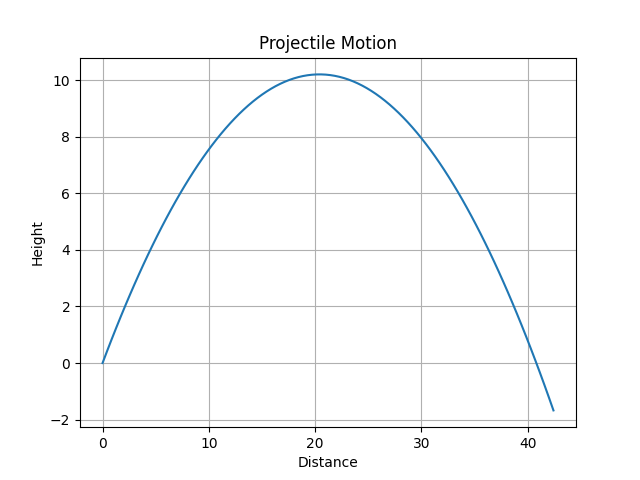
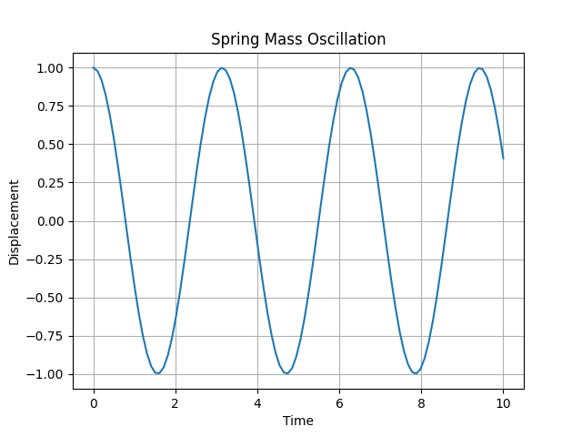

# 📘 Physics-Based Simulation and Mathematical Modeling Using Python

This repository contains Python implementations of fundamental physics simulations using mathematical modeling techniques. The project demonstrates how real-world physical systems can be represented using equations and solved computationally.

---

## 📌 Project Overview

This project includes simulations of:

1. Free Fall Motion  
2. Projectile Motion  
3. Spring-Mass Oscillation (Differential Equation Model)  

Each simulation uses scientific computing libraries in Python to calculate motion and generate graphical visualizations.

---

## 🛠️ Technologies Used

- Python 3  
- NumPy  
- Matplotlib  
- SciPy (for solving differential equations)  

---

## 📂 Project Structure

```
├── Free_Fall.py
├── Projectile.py
├── Spring-Mass.py
├── free_fall.png
├── projectile_motion.png
├── spring_mass.png
├── 📘 Report.pdf
└── README.md
```

---

# 1️⃣ Free Fall Simulation

## 📌 Description

This simulation models the vertical motion of an object falling under gravity using the kinematic equation:

y = y₀ + v₀t − (1/2)gt²

Where:
- y₀ = Initial height  
- v₀ = Initial velocity  
- g = Acceleration due to gravity (9.8 m/s²)  
- t = Time  

### 📊 Output

The graph below shows height vs time:



### ▶️ How to Run

```
python Free_Fall.py
```

---

# 2️⃣ Projectile Motion Simulation

## 📌 Description

This simulation models two-dimensional projectile motion using:

Horizontal Motion:
x = v₀ cos(θ) · t  

Vertical Motion:
y = v₀ sin(θ) · t − (1/2)gt²  

Assumptions:
- No air resistance  
- Constant gravitational acceleration  
- Independent horizontal and vertical motion  

### 📊 Output

Projectile trajectory graph:



### ▶️ How to Run

```
python Projectile.py
```

---

# 3️⃣ Spring-Mass Oscillation

## 📌 Description

This simulation models a simple harmonic oscillator using the differential equation:

m(d²x/dt²) + kx = 0  

Converted into first-order equations:

dx/dt = v  
dv/dt = −(k/m)x  

Solved numerically using SciPy's `odeint` function.

### 📊 Output

Oscillatory motion graph:



### ▶️ How to Run

```
python Spring-Mass.py
```

---

# 📈 Learning Outcomes

Through this project:

- Applied mathematical modeling to physical systems  
- Used Python for scientific computing  
- Visualized motion using graphical plots  
- Solved differential equations numerically  
- Understood dynamic system behavior  

---

# ⚙️ Installation

Install required libraries before running:

```
pip install numpy matplotlib scipy
```

---

# 📄 Report

A detailed project report is included:

📎 📘 Report.pdf

---

# 🎯 Conclusion

This project demonstrates how physics equations can be transformed into computational models. From basic kinematic equations to differential equation systems, Python provides powerful tools for simulation and visualization.

These simulations form the foundation of modern scientific computing, engineering analysis, and physics-based modeling.

---

## 👤 Author

Created as part of academic coursework in Physics-Based Simulation and Mathematical Modeling using Python.
